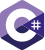

### Hi everyone!
# I'm **Jhoni Giacomolli**

I am definitely passionate about computing, I have been working informally with it since 2018, but since 2020 it has officially become my profession, I like to define myself as an eternal student

## My Skills
>'  

   
> '

